# MSOC-site
Данный сайт создан для быстрого поиска и скачивания музыки без ограничений!<br>
Вам лиш стоит ввести название музыки, как вам выведутся возможные варианты песен, а так же ссылки для их скачивания<br>

На сайте присутствует функция регистрации и авторизации по email<br>
Каждый пользователь имеет доступ к своим плейлистам

Присутствует функция жалоб, которая позволяет кинуть заявку на удаление какого либо файла<br>
Модеры сайта могут смотреть эти заявки, принимать их или отклонять

# Настройка
- Создайте виртуальное окружение в папке проекта коммандой:
`python -m venv venv`
- Установите нужные пакеты коммандой: `pip install -r requirements.txt`
- В каталоге проекта создайте файл `.env`
- Там разместите следующее:
```
DEBUG=<0 or 1>
SECRET_KEY=<YOUT-SECRET-KEY>
EMAIL_BACKEND=<EMAIL-BACKEND>
```
- Сохраните файл
- Для создание супер пользователя или "модера" введите комманду: `python manage.py createsuperuser`
- Запустите проект коммандой: `python manage.py runserver`

# Картинки
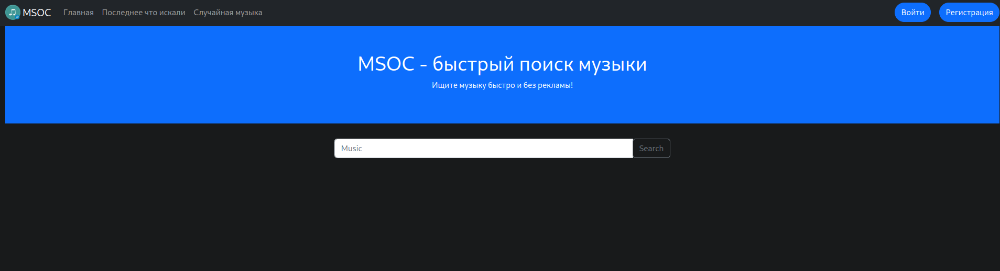
<hr>
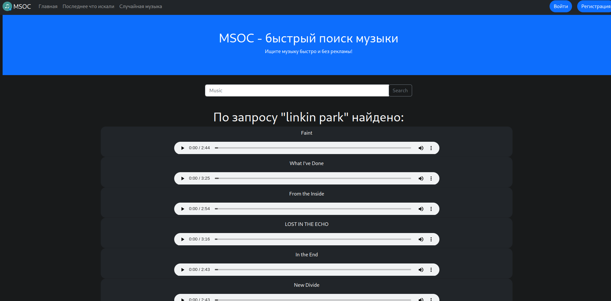
<hr>
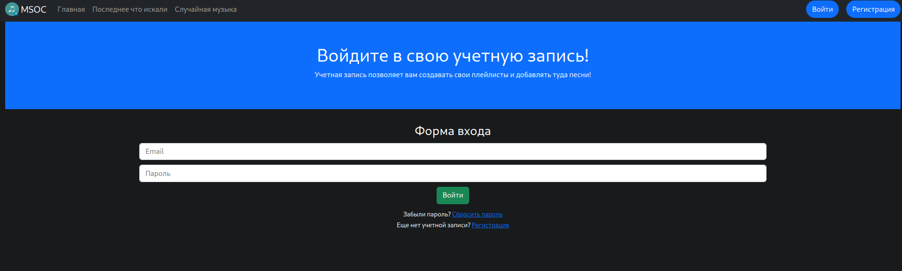
<hr>
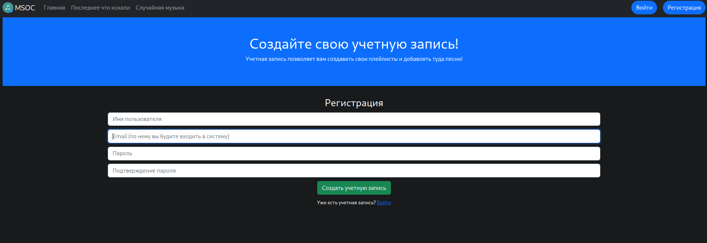
<hr>
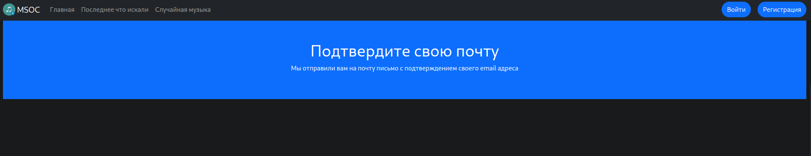
<hr>
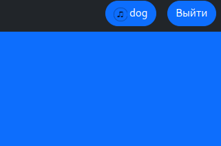
<hr>
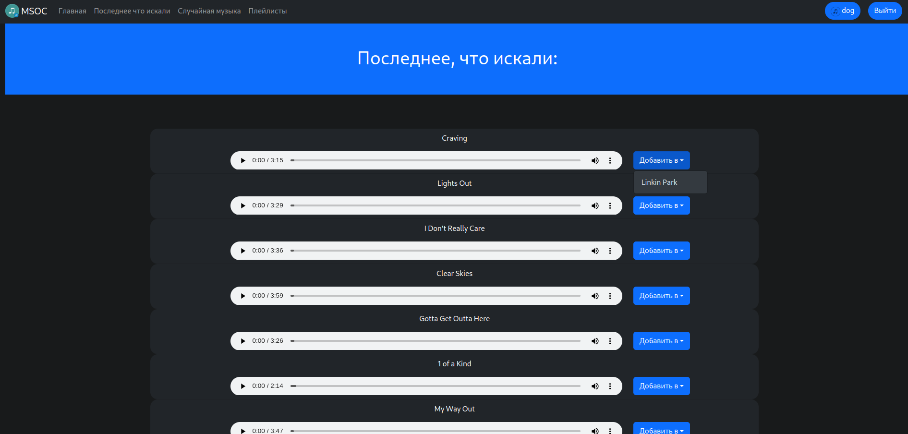
<hr>
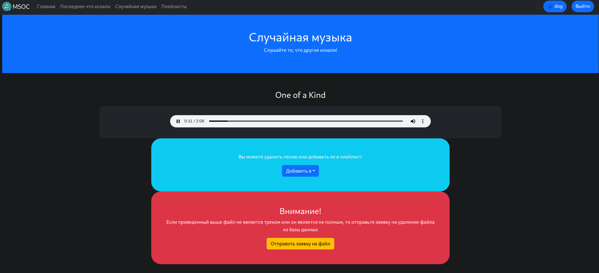
<hr>
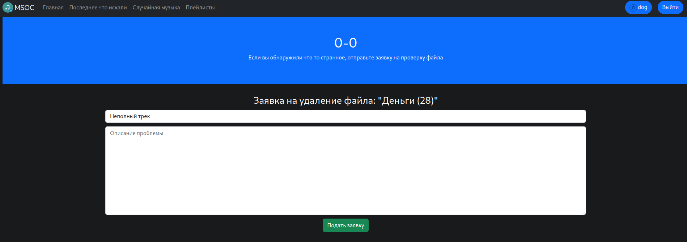
<hr>
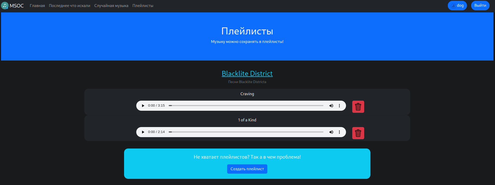
<hr>
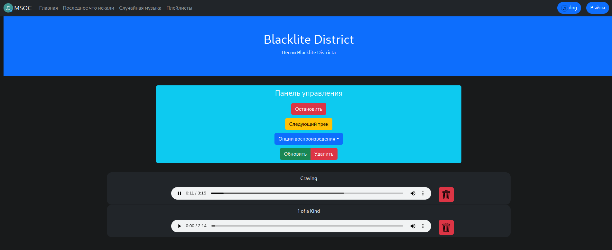
<hr>
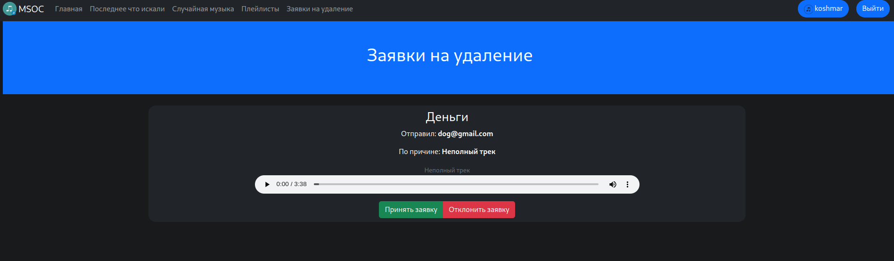


<hr>
<b>Приятного прослушивания!</b>